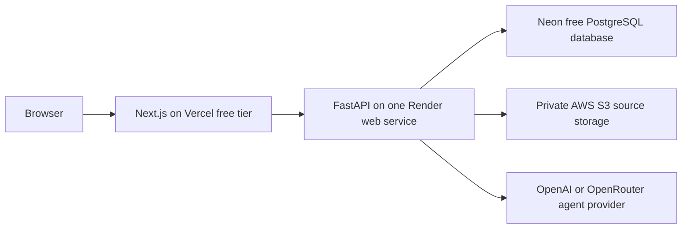

# CarbonSage Infrastructure

CarbonSage is the public product and service identity. The internal
`nzeroesg-client` and `nzeroesg-api` source directories, Vercel project,
environment-variable, database, and cookie identifiers remain unchanged to
avoid a low-value source-layout migration. The existing Render service is
renamed in place to `carbonsage-api`; it is not recreated, and it retains its
database, secrets, deployment history, and production role. Render preserves
the existing `nzeroesg-api` URL slug during an in-place service rename, so the
verified API origin remains stable.

## Cost and service boundary

The public prototype is designed to remain at or below $30 USD per month beyond
existing ChatGPT/Codex access:



The deployed product configures an assistant provider because the agent is the
primary experience. Deterministic shipment, evidence, scenario, report, and
export services still fail independently and remain usable if that external
provider is temporarily unavailable. Local development and CI may explicitly
disable the provider to preserve a credential-free baseline.

No Redis, message broker, MongoDB, former ChromaDB service, dedicated embedding
service, background worker, or storage microservice is required for the public
demo or CarbonSage initial track. Semantic retrieval uses pgvector in the
existing PostgreSQL deployment. Validated source files use one private S3
bucket with a separate application-enforced ceiling below USD $0.50/month.

## Local baseline

The credential-free local stack contains a frontend, API, and PostgreSQL
database:

```text
localhost:3000  Next.js frontend
       │
       ▼
localhost:8000  FastAPI backend
       │
       ▼
local PostgreSQL + pgvector   workspace, evidence, and embedding records
```

Start it with:

```bash
docker compose up --build
```

Compose uses the pinned `pgvector/pgvector:0.8.6-pg16-bookworm` image and
applies the checked-in migrations for workspace, evidence, and vector records.
Migration `005_artifact_catalog.sql` adds the workspace artifact catalog,
source links, and typed report snapshots. Migration
`006_artifact_object_storage.sql` adds the durable breaker ledger and private
source-object metadata. Migration `007_typed_agent_runtime.sql` adds bounded
conversations, messages, normalized citations, and concise tool events; local
storage and model providers remain explicitly disabled unless their respective
environment switches are enabled.
Native development without `DATABASE_URL` uses the explicitly documented
in-memory adapter; production must configure a managed PostgreSQL URL.

The Compose configuration intentionally sets `ASSISTANT_ENABLED=false`. This
keeps the baseline reproducible without provider credentials and verifies that
the product does not depend on a paid model API.

Health endpoints:

- frontend: `GET http://localhost:3000/`
- backend: `GET http://localhost:8000/health`
- typed-agent status: `GET http://localhost:8000/agent/health`

The backend health check gates frontend startup in Compose.

## Target deployment

The checked-in [`render.yaml`](../render.yaml) is the deployment handoff for
the API. It uses the production `main` branch and waits for CI checks to pass,
generates the session secret in Render, and declares `DATABASE_URL` as a
dashboard-supplied secret. Create or review the Blueprint in the Render
Dashboard, enter the Neon connection string, and deploy `main` only after a
verified `dev` release is promoted; this repository does not contain a deploy
hook or provider token.

Both Vercel and Render use `main` as the production boundary. Feature branches
merge into `dev` for CI and evaluation without deploying either public service.

### Frontend

- Vercel free tier;
- build from `nzeroesg-client`;
- configure `NEXT_PUBLIC_BACKEND_URL` with the public FastAPI origin;
- retain `https://nzeroesg-api.onrender.com` as that origin after the Render
  display-name change; no Vercel environment migration is required;
- no server-side user data stored in the frontend deployment;
- host the routed control plane and dedicated agent workspace in the same
  Next.js application, with an isolated embed route added later.

### Backend

- one Render web service built from `nzeroesg-api`;
- the existing Render resource is named `carbonsage-api` and remains the only
  API service;
- expose the FastAPI service and health endpoint;
- allow CORS only from the deployed frontend and documented local origins;
- enable the assistant with `ASSISTANT_ENABLED=true`, set `LLM_PROVIDER`, and
  configure the matching model name and provider credential; the checked-in
  production baseline uses OpenRouter while retaining the existing bounded
  request quota and fail-closed behavior;
- configure `EMBEDDING_PROVIDER`, `EMBEDDING_MODEL`, and the matching provider
  credential only when semantic retrieval should call an external embedding
  API; use `text-embedding-3-small` for OpenAI or the provider-qualified model
  identifier for OpenRouter, while lexical search remains credential-free;
- keep artifact, retrieval, conversation, embed-auth, and typed-tool modules in
  the same deployable service.

### Object storage

- one S3 Standard bucket in `ca-central-1`;
- private, TLS-only, bucket-owner-enforced access with complete public-access
  blocking and SSE-S3 encryption;
- one-day expiration and incomplete-multipart cleanup as the provider backstop;
- a runtime IAM policy scoped to location lookup and PUT/GET/DELETE under
  `workspaces/*`;
- PostgreSQL reservations before each S3 operation: 4 GB active storage,
  10,000 writes, 100,000 reads, and 2 GB egress per month;
- an estimated priced maximum of `$0.379` and rejected startup configuration if
  limits reach the approved `$0.50` S3 ceiling;
- API-proxied transfers only; no public or presigned URLs in the initial slice.

The checked-in CloudFormation handoff is
[`infra/aws/artifact-storage.yaml`](../infra/aws/artifact-storage.yaml). Set
`ARTIFACT_STORAGE_ENABLED=true`, `AWS_S3_BUCKET`, `AWS_S3_REGION`, and the
standard AWS credential variables in Render only after the bucket, lifecycle,
IAM policy, and AWS Budget alerts have been verified. The full decision and
activation checklist are in
[`decisions/001-aws-s3-artifact-source-storage.md`](decisions/001-aws-s3-artifact-source-storage.md).

### Database

- one small Neon PostgreSQL project using its Free plan for this bounded demo;
- migrations are required for schema changes;
- every user-owned record carries a workspace identifier;
- demo workspaces and extracted evidence expire after 24 hours by default;
- provision pgvector through checked-in migrations and store versioned
  embeddings in PostgreSQL; evaluation tunes retrieval behavior rather than
  gating vector capability.

Migration `004_pgvector_retrieval.sql` enables the `vector` extension and adds
workspace-scoped 1,536-dimensional embedding records with provider, model,
content-hash, and timestamp metadata. Existing evidence is lazily backfilled
within the current three-document workspace limit when semantic or hybrid
search is first requested.

The initial vector query is exact cosine search rather than an approximate
index. With the bounded demo corpus this preserves perfect recall and applies
the workspace predicate directly. HNSW remains a measured scale optimization,
not a prerequisite; shared approximate indexes can reduce recall after tenant
filtering.

Neon is a better fit than Render Postgres for this prototype: the current Neon
Free plan is $0, provides PostgreSQL with scale-to-zero, and is intended for
small intermittent workloads. Its limits still require monitoring, especially
compute-hours, storage, egress, and the public connection string. Render's free
Postgres is not selected because it expires after 30 days; the durable Render
`basic-1gb` tier is unnecessary for the demo and would consume most of the
monthly ceiling.

## Data and upload limits

The backend must enforce the public limits from the roadmap:

- 500 shipment rows per CSV or XLSX workbook (enforced by the upload parser);
- 3 evidence documents per workspace;
- 10 MB per file (enforced before parsing);
- text-based evidence only;
- 10 analysis or scenario runs per workspace per day (enforced server-side);
- 3 assistant requests per workspace per day.

Original shipment and evidence files are private and downloadable only until
their workspace/source expiry, never longer than 24 hours. Normalized text,
metadata, citations, and report snapshots live in PostgreSQL until workspace
expiry.

## Deployment safety

Historical Render deploy hooks were committed in an earlier workflow. On
August 5, 2026, the user confirmed that the Render API key was rotated and the
historical hook references were disabled. On August 9, the suspended legacy
`nzeroesg-embedder` service was permanently deleted after explicit approval.
The in-place `carbonsage-api` resource is now the only Render service for this
project. No Render deployment workflow is currently tracked. If a future
backend service is created, deployment configuration must use newly managed
repository or provider-managed secrets and must not restore historical hook
credentials.

CI must remain credential-free and run:

- repository secret-pattern checks;
- backend lint, formatting, and tests;
- frontend type checking, lint, formatting, and production build;
- production dependency audit.
- the local browser smoke suite against disposable PostgreSQL, covering the
  primary demo journey and workspace isolation.

The browser suite is a local/CI gate; it does not substitute for the public
deployment smoke check.

Public verification snapshot from August 8, 2026:

- `https://n-zero-esg-scope3.vercel.app/` serves the rebuilt client from
  `main`, and `/login` returns `200`.
- `https://nzeroesg-api.onrender.com/health` serves the `carbonsage-api`
  FastAPI service with Neon-backed production persistence and reports semantic
  search enabled.
- The exact Vercel-origin CORS preflight passes.
- The assistant health route is reachable and the disabled assistant fails
  closed with `503` rather than affecting the deterministic workflow.
- The public Playwright journey passes shipment ingestion, cited evidence,
  scenarios, report export, workspace isolation, keyboard entry, and narrow
  viewport checks.

Future embed verification must add a second, vanilla JavaScript host origin,
test with third-party cookies blocked, and confirm that only the embed route is
frameable by its configured origin.
